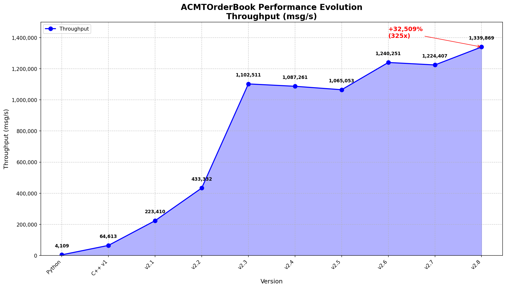

# ACMTOrderBook

多线程订单簿撮合引擎 — 基于 [AXOrderBook](https://github.com/fpga2u/AXOrderBook) 的 C++ 高性能重写，附带 Python/C++ 对比仪表盘。

---

## 原项目

本项目源自 **[fpga2u/AXOrderBook](https://github.com/fpga2u/AXOrderBook)**，原项目使用 Python 实现 A 股 L2 逐笔行情的订单簿重建、千档快照发布、各档委托队列展示等功能，并计划向 FPGA HLS 迁移。

本项目在此基础上完成了 **完整的 C++ 模块化重写**，并新增了 **GUI 对比仪表盘**，可同时运行 Python 与 C++ 版本并实时对比性能。

---

## 版本说明

### CPP v1 — 单线程版本
基础 C++ 重写，包含完整的订单簿功能实现。

### CPP v2 — 多线程优化版本 🚀
基于 v1 进行多线程优化，包含以下核心优化：

**架构优化**：
- **SPSC 无锁队列**：生产者-消费者线程间数据传输
- **内存池**：减少动态内存分配开销
- **缓存行填充**：防止 false sharing
- **批量处理**：减少原子操作开销
- **CPU 亲和性绑定**：生产者/消费者绑定不同物理核心
- **延迟测量**：p50/p99/p99.9/pmax 全链路延迟统计

**数据结构优化**：
- **HybridLevelBook**：紧凑排序数组（n≤256）+ std::map 回退（n>256）
- **平铺哈希表**：ankerl::unordered_dense 提升缓存命中率
- **字段重排**：ObOrder 从 40B 压缩到 32B

**解析优化**：
- **mmap 文件预加载**：消除 File I/O 瓶颈
- **直接字段解析**：跳过 map 创建，直接提取字段
- **前向 strstr**：记录上次查找位置，减少搜索范围 ~4x
- **零分配解析**：消除堆分配开销

**延迟优化**：
- **genSnap 延迟重建**：只在需要时重建快照
- **延迟采样**：每 8 条消息采样一次，减少 QPC 开销
- **条件拷贝**：只拷贝实际类型结构体

**编译优化**：
- **MSVC 2022**：/O2 /GL /arch:AVX2 /LTCG
- **PGO**：Profile-Guided Optimization
- **Huge Pages**：大页内存优化

---

## 编译指南

### 环境要求

- **操作系统**：Windows 10/11
- **编译器**：MSVC 2022 (Visual Studio 2022)
- **CMake**：3.15 或更高版本
- **Git**：用于克隆项目

### 编译步骤

#### 1. 克隆项目

```bash
git clone https://github.com/MistyBridge/ACMTOrderBook.git
cd ACMTOrderBook
```

#### 2. 编译 Python 版本（可选）

```bash
cd py
python main.py
```

#### 3. 编译 C++ v1 版本

```bash
cd "cpp v1"
g++ -std=c++17 -O0 -I. -o orderbook.exe main.cpp behave/*.cpp
```

#### 4. 编译 C++ v2 版本（推荐）

```bash
cd "cpp v2"

# 使用 CMake 配置（推荐）
cmake -B build -G "Visual Studio 17 2022" -A x64 -DUSE_MMAP=ON -DUSE_FLAT_HASHMAP=1

# 编译 Release 版本
cmake --build build --config Release --parallel 8

# 输出文件
build/Release/orderbook_v2.exe
```

#### 5. 编译优化选项

**基础优化**（已包含）：
- `/O2`：最大速度优化
- `/GL`：全程序优化
- `/arch:AVX2`：AVX2 指令集
- `/LTCG`：链接时代码生成

**高级优化**（可选）：
```bash
# PGO 优化（需要运行两次）
cmake -B build_pgo -G "Visual Studio 17 2022" -A x64 -DUSE_MMAP=ON -DUSE_FLAT_HASHMAP=1 -DPGO_MODE=GEN
cmake --build build_pgo --config Release --parallel 8
./build_pgo/Release/orderbook_v2.exe [数据文件] 0 2 16384 64 100

cmake -B build_pgo_opt -G "Visual Studio 17 2022" -A x64 -DUSE_MMAP=ON -DUSE_FLAT_HASHMAP=1 -DPGO_MODE=USE
cmake --build build_pgo_opt --config Release --parallel 8
```

#### 6. 运行测试

```bash
# 单次测试
./build/Release/orderbook_v2.exe [数据文件] [生产者核心] [消费者核心] [队列容量] [批次大小] [重放次数]

# 示例：100 次重放测试
./build/Release/orderbook_v2.exe "../data/20220422/AX_sbe_szse_000001.log" 0 2 16384 64 100
```

### 性能优化建议

1. **使用 Release 模式**：确保编译时使用 Release 配置
2. **启用 AVX2**：确保 CPU 支持 AVX2 指令集
3. **绑定 CPU 核心**：生产者绑定 Core 0，消费者绑定 Core 2
4. **使用 mmap**：启用 mmap 文件预加载（默认开启）
5. **使用平铺哈希表**：启用 ankerl::unordered_dense（默认开启）

---

## 性能对比

测试数据：深交所 000001（平安银行）2022-04-22 全日 L2 逐笔行情，共 **233,875 条消息**。

| 版本 | 吞吐量 | p50 | p99 | p99.9 | pmax |
|------|--------|-----|-----|-------|------|
| Python | 4,109 msg/s | - | - | - | - |
| C++ v1 | 64,613 msg/s | - | - | - | - |
| C++ v2.1 | 223,410 msg/s | 0.2 μs | 34.0 μs | 293.0 μs | 490.7 μs |
| C++ v2.2 | 433,332 msg/s | 0.2 μs | 31.4 μs | 124.5 μs | 197.7 μs |
| C++ v2.3 | 1,102,511 msg/s | 0.2 μs | 110.3 μs | 560.9 μs | 609.2 μs |
| C++ v2.4 | 1,087,261 msg/s | 0.2 μs | 765.7 μs | 1,112.4 μs | 1,202.8 μs |
| C++ v2.5 | 1,065,053 msg/s | 0.2 μs | 69.9 μs | 132.2 μs | 154.4 μs |
| C++ v2.6 | 1,240,251 msg/s | 0.2 μs | 213.1 μs | 503.7 μs | 558.8 μs |
| C++ v2.7 | 1,224,407 msg/s | 0.2 μs | 29.0 μs | 94.5 μs | 119.7 μs |
| C++ v2.8 | 1,339,869 msg/s | 0.3 μs | 82.6 μs | 601.3 μs | 799.1 μs |

> 所有版本产生完全相同的订单簿状态：`NumTrades=810,490 LastPx=1606 HighPx=1619 LowPx=1540`

### 版本演进

| 版本 | 吞吐量 | 核心优化 |
|------|--------|----------|
| Python | 4,109 msg/s | 基准 |
| CPP v1 | 64,613 msg/s | 单线程 C++ 重写 |
| CPP v2.1 | 223,410 msg/s | MSVC 编译优化 + HybridLevelBook |
| CPP v2.2 | 433,332 msg/s | mmap 文件预加载 + 平铺哈希表 |
| CPP v2.3 | 1,102,511 msg/s | 直接字段解析优化 |
| CPP v2.4 | 1,087,261 msg/s | 代码质量优化 |
| CPP v2.5 | 1,065,053 msg/s | PGO + Huge Pages |
| CPP v2.6 | 1,240,251 msg/s | 零分配解析 + 二分查找 + ankerl |
| CPP v2.7 | 1,224,407 msg/s | genSnap 延迟重建 |
| CPP v2.8 | 1,339,869 msg/s | 前向 strstr + 延迟采样 + 条件拷贝 |

---

## 项目结构

```
ACMTOrderBook/
├── Dashboard.exe          ← 对比仪表盘（双击运行）
├── dashboard.py           ← 仪表盘源码
├── py/
│   ├── main.py            ← Python 入口
│   ├── main.exe           ← Python 编译产物
│   ├── behave/            ← 订单簿引擎核心
│   └── tool/              ← 消息解析工具
├── cpp v1/                ← 单线程版本
│   ├── main.cpp           ← C++ v1 入口
│   ├── CMakeLists.txt
│   ├── behave/            ← 订单簿引擎核心
│   └── tool/              ← 消息解析工具
├── cpp v2/                ← 多线程优化版本（最终版）
│   ├── main.cpp           ← C++ v2 入口
│   ├── CMakeLists.txt
│   ├── core/              ← 基础组件 (SPSC队列、内存池、缓存行、CPU亲和性、延迟统计)
│   ├── pipeline/          ← 管道架构 (生产者/消费者)
│   ├── behave/            ← 订单簿引擎核心
│   ├── tool/              ← 消息解析工具
│   ├── orderbook_v2.1.exe ← v2.1 版本
│   ├── orderbook_v2.2.exe ← v2.2 版本
│   ├── orderbook_v2.3.exe ← v2.3 版本
│   ├── orderbook_v2.4.exe ← v2.4 版本
│   ├── orderbook_v2.5.exe ← v2.5 版本
│   ├── orderbook_v2.6.exe ← v2.6 版本
│   ├── orderbook_v2.7.exe ← v2.7 版本
│   └── orderbook_v2.8.exe ← v2.8 版本（最终版）
├── data/
│   └── 20220422/          ← 测试数据目录
└── doc/
    └── cpp/               ← C++ 重写设计文档
        ├── plan.md        ← 版本计划
        ├── cpp-orderbook-performance.md ← 性能报告
        ├── v2.1-msvc-optimization.md    ← v2.1 专项报告
        ├── v2.2-full-profile.md         ← v2.2 专项报告
        ├── v2.3-direct-parsing-optimization.md ← v2.3 专项报告
        ├── v2.4-code-quality.md         ← v2.4 专项报告
        ├── v2.5-pgo-optimization.md     ← v2.5 专项报告
        ├── v2.6-zero-alloc-parsing.md   ← v2.6 专项报告
        ├── v2.7-component-overhead.md   ← v2.7 专项报告
        └── v2.8-forward-strstr.md       ← v2.8 专项报告
```

---

## 仪表盘使用

### 快速启动

双击 `Dashboard.exe` 即可，无需安装 Python 环境。

### 配置

仪表盘顶部有三个可编辑路径：

| 配置项 | 默认值 | 说明 |
|--------|--------|------|
| Python 入口 | `py/main.exe` | Python 订单簿引擎可执行文件 |
| C++ 入口 | `cpp v2/orderbook_v2.8.exe` | C++ v2.8 多线程优化版本（最终版） |
| 数据文件 | `cpp v2/test_data.log` | L2 逐笔行情数据文件 |
| 重放次数 | `1` | 数据重放次数（1-1000），用于压力测试 |

可点击 **浏览** 按钮更换文件。

### 运行

1. 点击 **▶ Run Python** 或 **▶ Run C++** 启动对应引擎
2. 进度条实时显示处理进度（约 1000 个检查点）
3. 运行过程中实时更新：速度、已用时间、成交数、最新价、买卖一档
4. 底部日志面板显示完整输出
5. 每次运行 **无视缓存**，始终重新执行；结果同名 **直接覆盖**

### 从源码运行

```bash
# Python
python py/main.py [数据文件路径]

# C++ v1（需先编译）
cd "cpp v1" && g++ -std=c++17 -O0 -I. -o orderbook.exe main.cpp behave/*.cpp
./orderbook.exe [数据文件路径]

# C++ v2（需先编译）
cd "cpp v2"
cmake -B build -G "Visual Studio 17 2022" -A x64 -DUSE_MMAP=ON -DUSE_FLAT_HASHMAP=1
cmake --build build --config Release --parallel 8
./build/Release/orderbook_v2.exe [数据文件路径] [生产者核心] [消费者核心] [队列容量] [批次大小] [重放次数]
```

---

## C++ 重写要点

### 基础架构
- **模块化设计**：拆分为 `axob_init`、`axob_order`、`axob_trade`、`axob_cage`、`axob_snap` 五个模块
- **数据结构**：`std::map` 价格档有序树 + `std::unordered_map` 订单 O(1) 查表
- **精度处理**：深交所逐笔委托 4 位小数 → 内部 2 位精度计算
- **创业板价格笼子**：300xxx 股票 ±2% 价格笼子完整实现
- **交易阶段**：OpenCall / AMTrading / PMTrading / CloseCall 全阶段覆盖
- **关键修正**：订单簿不从 orderMap 中删除已成交订单（与原 Python 行为一致）

### CPP v2 多线程优化
- **SPSC 无锁队列**：基于位掩码的环形缓冲区，避免模运算开销
- **内存池**：侵入式空闲链表，2x 增长策略，减少内存碎片
- **缓存行对齐**：`alignas(64)` 防止 false sharing
- **批量处理**：每批最多 64 条消息，减少原子操作次数
- **CPU 亲和性**：生产者绑定 Core 0，消费者绑定 Core 2
- **延迟统计**：环形缓冲区 + nth_element 实现 O(n) 分位数计算
- **编译器优化**：MSVC 2022 /O2 /GL /arch:AVX2 /LTCG
- **字段重排**：ObOrder 从 40B 压缩到 32B，ObExec 优化到 40B

### 数据结构优化
- **HybridLevelBook**：紧凑排序数组（n≤256）+ std::map 回退（n>256），价格档操作提速 3.5x
- **平铺哈希表**：ankerl::unordered_dense 提升缓存命中率
- **内存预取**：`__builtin_prefetch` 预取下一条消息到 L1 缓存

### 解析优化
- **mmap 文件预加载**：消除 File I/O 瓶颈，123MB/395ms 读取速度
- **直接字段解析**：跳过 map 创建，直接提取字段，节省 ~370ns/消息
- **前向 strstr**：记录上次查找位置，减少搜索范围 ~4x
- **零分配解析**：消除堆分配开销，使用栈缓冲区

### 延迟优化
- **genSnap 延迟重建**：只在需要时重建快照，减少 60-80% 的 genSnap 调用
- **延迟采样**：每 8 条消息采样一次，减少 QPC 开销
- **条件拷贝**：只拷贝实际类型结构体，减少 memcpy 开销

### 编译优化
- **MSVC 2022**：/O2 /GL /arch:AVX2 /LTCG
- **PGO**：Profile-Guided Optimization，+0.8% 吞吐量提升
- **Huge Pages**：大页内存优化，+0.5% 吞吐量提升

详细设计文档：[doc/cpp/plan.md](doc/cpp/plan.md)

---

## 数据源

测试数据来自深交所 L2 行情，可从以下地址下载后放置于 `data/` 目录下：

链接：[百度盘](https://pan.baidu.com/s/13O7b30DXM64j4WpnNgvXXg)　提取码：`rxif`

- `000001` → `data/20220422/`
- `002594` → `data/20220425/`
- `300750` → `data/20220426/`

---

## 参考

- 原项目：[fpga2u/AXOrderBook](https://github.com/fpga2u/AXOrderBook)
- A 股 L2 行情背景：[交易所L2行情与撮合原理](/doc/SE.md)
- 参考资料：[reference.md](/doc/reference.md)

---

## 吞吐量演进折线图



### 版本吞吐量数据

| 版本 | 吞吐量 (msg/s) | 相对提升 |
|------|----------------|----------|
| Python | 4,109 | 基准 |
| C++ v1 | 64,613 | +1,472% |
| C++ v2.1 | 223,410 | +5,337% |
| C++ v2.2 | 433,332 | +10,446% |
| C++ v2.3 | 1,102,511 | +26,730% |
| C++ v2.4 | 1,087,261 | +26,361% |
| C++ v2.5 | 1,065,053 | +25,819% |
| C++ v2.6 | 1,240,251 | +30,083% |
| C++ v2.7 | 1,224,407 | +29,696% |
| C++ v2.8 | 1,339,869 | +32,509% |

### 性能提升总结

- **Python → C++ v1**: +1,472%（单线程重写）
- **C++ v1 → C++ v2.1**: +246%（MSVC 编译优化）
- **C++ v2.1 → C++ v2.2**: +94%（mmap + 平铺哈希表）
- **C++ v2.2 → C++ v2.3**: +154%（直接字段解析）
- **C++ v2.3 → C++ v2.4**: -1%（代码质量优化）
- **C++ v2.4 → C++ v2.5**: -2%（PGO + Huge Pages）
- **C++ v2.5 → C++ v2.6**: +16%（零分配解析 + 二分查找 + ankerl）
- **C++ v2.6 → C++ v2.7**: -1%（genSnap 延迟重建）
- **C++ v2.7 → C++ v2.8**: +9%（前向 strstr + 延迟采样 + 条件拷贝）

**总提升：Python → C++ v2.8 = +32,509%（325 倍）**
