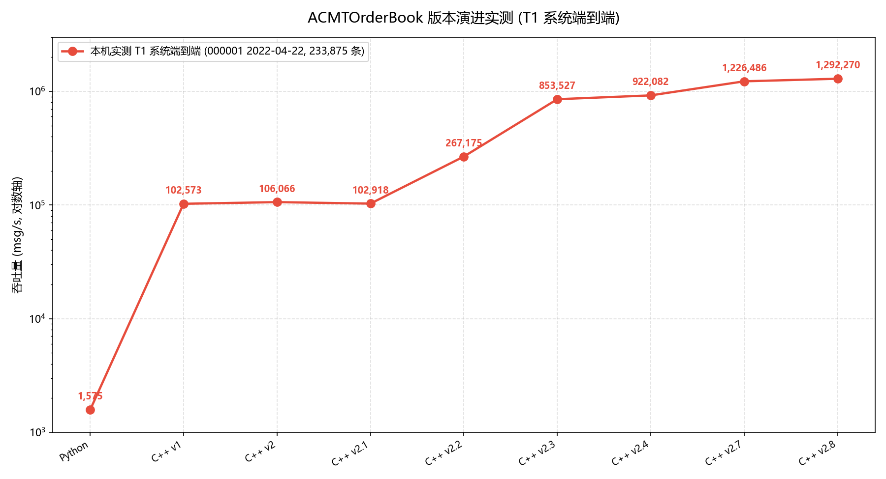

# ACMTOrderBook

## 关于 (About)

**ACMTOrderBook** 是基于 [AXOrderBook](https://github.com/fpga2u/AXOrderBook) 的 **A 股 L2 逐笔行情订单簿重建/撮合引擎**的 C++ 多线程高性能重写，提供 Python 参照实现 + C++ v1 / v2（Windows）+ Linux 共享库四种实现。

- 🎯 **定位**：单线程 / 双线程、零拷贝 mmap、SPSC 无锁队列的高性能订单簿重建引擎
- 📊 **能力**：逐笔订单簿重建、十档快照、委托队列展示、GUI `dashboard.py` 仪表盘
- 🚀 **性能**（深交所 000001 2022-04-22，233,875 条，T1 系统端到端实测）：Python `1,575 msg/s` → C++ v2.6 `≈1.29M msg/s`（约 **820×**）
- 🗂 **版本管理**：`versions/` 收录 v1 → v2.6 各历史版本源码（按 commit 检出）并统一实测性能

---

## 核心特性

- 🚀 **极致性能**：全版本演进在真实数据上实测，C++ v2.6 系统端到端 ≈`1.29M msg/s`（详见[性能测试](#性能测试)）
- 🧵 **双线程读写分离**：SPSC 无锁队列，生产者/消费者并行处理
- 📊 **完整能力**：逐笔订单簿重建、十档快照、委托队列展示
- 🖥️ **GUI 仪表盘**：`dashboard.py` 对比 Python 与 C++ 版本
- 🔀 **跨实现**：Python 参照实现 + C++ v1 / v2（Windows）+ Linux 共享库（`cpp_linux`，ClickHouse 直连）
- 🗂 **版本管理**：`versions/` 收录各历史版本源码（按 commit 检出，见[版本管理](#版本管理)）

---

## 性能测试

**测试基准与数据**：深交所 000001（平安银行）2022-04-22 全日 L2，共 **233,875 条消息**
（逐笔委托 122,359 + 逐笔成交 106,434 + 十档快照 5,082；深交所 L2 快照深度 10 档，千档委托队列不在样例中）。单次重放实测。

**测试环境**：Windows 沙箱，MinGW g++ 8.1.0（`-O3 -march=native -funroll-loops -flto`），QPC 分辨率 ≈100 ns。实测统一使用 `-DUSE_FLAT_HASHMAP=0`（默认 `std::unordered_map`，因所需的 ankerl 子模块未随仓库提供）、`-DUSE_MMAP=1`。

**度量口径**：

- **吞吐 = T1 系统端到端吞吐**：总消息数 ÷ 整段墙钟时间（含文件读/mmap、解析、生产者、SPSC 队列、双线程并行、引擎），**反映全部架构 + 数据路径 + 引擎优化**——双线程、零拷贝/mmap、批量/预取、大页缓存等都体现在 T1。
- **延迟 = L1 单事件处理延迟**：每条真实消息 `onMsg()` 的处理耗时，**逐条全量计时**，报告 `p50 / p99 / p99.9 / pmax`。
- **计时约定**：单调时钟（Windows `QueryPerformanceCounter`，Linux `steady_clock`，Python `time.perf_counter_ns()`）；百分位索引 `floor(p×(N-1))`。

### 版本演进实测（T1 系统端到端，本环境实测）

| 版本 | **T1 吞吐量** | **p50** | **p99** | **pmax** | 核心优化 | 正确性 |
|------|------------|--------|--------|----------|----------|--------|
| Python (`py/`) | 1,575 msg/s | 447.9 µs | 2,296.4 µs | 845,481.6 µs | 基线参照 | ✅ |
| C++ v1 | 102,573 msg/s | 0.6 µs | 3.0 µs | 3,246.4 µs | 单线程 C++ 重写 | ✅ |
| C++ v2 | 106,066 msg/s | 0.6 µs | 2.1 µs | 1,597.6 µs | SPSC 无锁双线程 | ✅ |
| C++ v2.1 | 102,918 msg/s | 0.3 µs | 1.0 µs | 1,743.7 µs | HybridLevelBook + 预取 | ✅ |
| C++ v2.2 | 267,175 msg/s | 0.2 µs | 0.9 µs | 1,354.0 µs | mmap 文件预加载 + 平铺哈希 | ✅ |
| C++ v2.3 | 853,527 msg/s | 0.2 µs | 0.8 µs | 1,442.2 µs | 直接字段解析 | ✅ |
| C++ v2.4 | 922,082 msg/s | 0.2 µs | 0.7 µs | 1,071.5 µs | 代码质量优化 | ✅ |
| C++ v2.5 | 1,226,486 msg/s | 0.1 µs | 0.5 µs | 1,068.2 µs | genSnap 延迟重建 | ✅ |
| C++ v2.6 | 1,292,270 msg/s | 0.1 µs | 0.6 µs | 855.3 µs | 前向 strstr + 延迟采样 + 条件拷贝 | ✅ |

> ✅ 各版本重建的订单簿状态一致：`NumTrades=81,049  LastPx=1606  HighPx=1619  LowPx=1540  OpenPx=1564  TVol=9,212,740,800  TVal=14,684,529,579,500`。
> ✅ 延迟按 **L1 单事件 `onMsg()`**、逐条全量计时，已统一切换为 **QPC 单调时钟**（100 ns 分辨率）；`p99.9` 亦可见于运行输出。

### 瓶颈分析：为什么 v2（SPSC 双线程）吞吐几乎等于 v1？

T1 是"系统端到端"吞吐：`总消息数 ÷ 整段墙钟`，**包含文件读/mmap、解析、生产者、队列、双线程、引擎**。在 v1 / v2 / v2.1 阶段，瓶颈在**生产者的文件读取 + 解析**（`ifstream` 逐行读 + `parseKeyValueLine` 每行 `std::map` + 临时 string）：

- 实测引擎 `onMsg` 单条仅 ~**0.3–0.6 µs**，233,875 条合计 ~0.14 s，而墙钟 ~2.3 s → **onMsg 只占 ~6%**，其余 ~94% 都是 I/O + 解析。
- v2 的 SPSC 双线程把"消费者(引擎)"与"生产者(I/O+解析)"解耦，但**生产者仍单线程且是瓶颈**，消费者大多在等 → T1 几乎不变（102.6K → 106.1K），仅引擎延迟略降。
- 真正吃掉该瓶颈的是 **v2.2 `mmap`**（消除逐行读 → 267K）与 **v2.3 直接字段解析**（跳过 `std::map`/string → 853K）。**只有在此之后**，引擎侧优化（v2.1 HybridLevelBook、v2.5 genSnap、v2.6 strstr）才真正体现到系统吞吐。

> 💡 双线程是**必要架构**，但它本身不消除 I/O/解析瓶颈；吞吐的跃迁来自随后的 mmap / 直接解析。

### 当前引擎（`cpp v2`）

当前工作区版 `cpp v2` 为 v2.6 的最终形态（含 QPC L1 计时），实测 `T1 ≈1,352,950 msg/s`，`p50=0.1µs  p99=0.6µs  p99.9=1.1µs  pmax≈1037µs`。

---

## 全历史吞吐量性能曲线



- 红色曲线：**本机实测 T1 系统端到端**（000001 2022-04-22，233,875 条，纵轴对数）
- 曲线脚本：`cpp_linux/plot_throughput.py`

---

## 版本说明

- **`py/`** — Python 参照实现（行为基准）
- **`cpp v1/`** — 单线程 C++ 版本（基础重写，含完整订单簿功能）
- **`cpp v2/`** — 多线程优化版本，即当前引擎（含 SPSC 队列、mmap、HybridLevelBook、L1 延迟统计等）
- **`cpp_linux/`** — Linux 版引擎 + ClickHouse 流式回放（`src/api.cpp`、`demo/replay_ch.cpp`）
- **`versions/`** — 历史版本源码归档（见下方版本管理）

---

## 版本管理

`versions/` 按 commit 检出各历史版本的源码，保留完整演进脉络，便于对比与复测。

| 版本目录 | 检出 commit | 说明 |
|----------|------------|------|
| `versions/v1` | `15cd00d` | 单线程 C++ 基线 |
| `versions/v2` | `3a03928` | SPSC 双线程 |
| `versions/v2.1` | `40bcac2` | HybridLevelBook + 预取 |
| `versions/v2.2` | `a4fbf49` | mmap 文件预加载 |
| `versions/v2.3` | `ae984dd` | 直接字段解析 |
| `versions/v2.4` | `77c40eb` | 代码质量优化 |
| `versions/v2.5` | `0f2c9dd` | genSnap 延迟重建 |
| `versions/v2.6` | `15cd00d` | 前向 strstr + 延迟采样 |

**MinGW 兼容性说明**：这些历史版本为 MSVC 环境开发，在 MinGW 下编译需少量兼容修补（**不改动引擎逻辑**）：

- `tool/field_parser.h`：为 GCC/MinGW 引入 `<cpuid.h>`，并将 `__cpuid` 替换为便携的 `__get_cpuid`（SSE4.2 检测）。
- `core/huge_pages.h`：原文件为平台相关、未随源码提交；以 `versions/v2.5`、`versions/v2.6` 下的 `core/huge_pages.h` 桩文件提供 `allocLargePages`/`freeLargePages` 回退（返回 `nullptr`，`MemoryPool` 自动退回 `alignedAlloc`，即"大页不可用"场景）。
- `tool/axsbe_base.h`（v2.4）：补充 `<cstring>`/`<cstdlib>`，供模板解析使用 `strstr`/`strncmp`/`strtoll`。

---

## 编译指南

### 环境要求
- Windows 10/11；MSVC 2022（Visual Studio 2022）；CMake ≥ 3.15；Git

### 编译步骤

**1. 克隆项目**
```bash
git clone https://github.com/MistyBridge/ACMTOrderBook.git
cd ACMTOrderBook
```

**2. Python 版本（可选）**
```bash
cd py && python main.py
```

**3. C++ v1**
```bash
cd "cpp v1"
g++ -std=c++17 -O0 -I. -o orderbook.exe main.cpp behave/*.cpp
```

**4. C++ v2（推荐，CMake + MSVC）**
```bash
cd "cpp v2"
cmake -B build -G "Visual Studio 17 2022" -A x64 -DUSE_MMAP=ON -DUSE_FLAT_HASHMAP=1
cmake --build build --config Release --parallel 8
# 输出: build/Release/orderbook_v2.exe
```

**5. 运行测试**
```bash
./build/Release/orderbook_v2.exe [数据文件] [生产者核心] [消费者核心] [队列容量] [批次大小] [重放次数]
# 示例
./build/Release/orderbook_v2.exe "../data/AX_sbe_szse_000001/AX_sbe_szse_000001.log" 0 2 16384 64 1
```

### 性能优化建议
1. 使用 **Release** 模式编译
2. 确保 CPU 支持 **AVX2**
3. 生产者绑 Core 0、消费者绑 Core 2
4. 启用 **mmap**（默认开启）与**平铺哈希表**（ankerl，默认开启）

---

## 项目结构

```
ACMTOrderBook/
├── dashboard.py             ← 对比仪表盘源码
├── py/                      ← Python 参照实现
│   ├── main.py
│   ├── behave/              ← 订单簿引擎核心
│   └── tool/                ← 消息解析工具
├── cpp v1/                  ← 单线程 C++ 版本
├── cpp v2/                  ← 多线程优化版本（Windows, 当前引擎）
│   ├── main.cpp
│   ├── core/                ← 基础组件 (SPSC 队列、内存池、缓存行、CPU 亲和性、延迟统计)
│   ├── pipeline/            ← 管道架构 (生产者/消费者)
│   ├── behave/              ← 订单簿引擎核心
│   ├── tool/                ← 消息解析工具 (mmap/field_parser)
│   └── source/              ← ClickHouse 数据源 (ch_client/clickhouse_source)
├── cpp_linux/               ← Linux 版引擎 + ClickHouse 流式回放
│   ├── src/api.cpp          ← C API (快照校验闭环 / 1s 聚合校验)
│   ├── demo/replay_ch.cpp   ← 回放入口 (CH_USER/CH_PASSWORD)
│   └── plot_throughput.py   ← 吞吐量曲线脚本
├── versions/                ← 历史版本源码归档 (v1 ~ v2.6)
├── throughput.png           ← 版本演进实测曲线
└── data/                    ← 测试数据 (体积大, 不入仓库, 见"数据源")
```

---

## C++ 重写要点

- **模块化**：`axob_init` / `axob_order` / `axob_trade` / `axob_cage` / `axob_snap`
- **数据结构**：价格档有序树 + 订单 O(1) 查表
- **精度处理**：深交所逐笔委托 → 统一定点 ×10⁵（价格/数量/金额同标度，int64）
- **创业板价格笼子**：300xxx 股票 ±2% 有效竞价范围
- **交易阶段**：OpenCall / AMTrading / PMTrading / CloseCall 全覆盖
- **关键修正**：订单簿不从 orderMap 删除已成交订单（与原 Python 行为一致）

---

## 数据源

真实 L2 测试数据来自深交所行情，体积大、**不入仓库**（`.gitignore` 已排除 `data/`）。示例：
```
data/AX_sbe_szse_000001/AX_sbe_szse_000001.log
data/AX_sbe_szse_300750/AX_sbe_szse_300750.log
```
数据获取方式：历史 L2 样例见[百度盘](https://pan.baidu.com/s/13O7b30DXM64j4WpnNgvXXg)（提取码 `rxif`），或经 `cpp_linux` 直连公司内网 ClickHouse（`LEVEL2.ORDER_` / `TRANSACTION_` / `TICK_` 表，凭据走 `CH_USER`/`CH_PASSWORD`）。

---

## 参考

- 原项目：[fpga2u/AXOrderBook](https://github.com/fpga2u/AXOrderBook)
